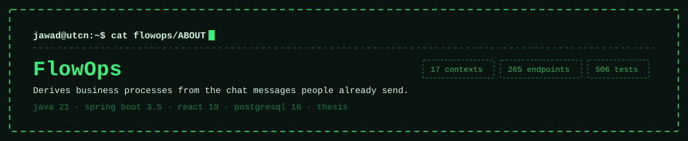
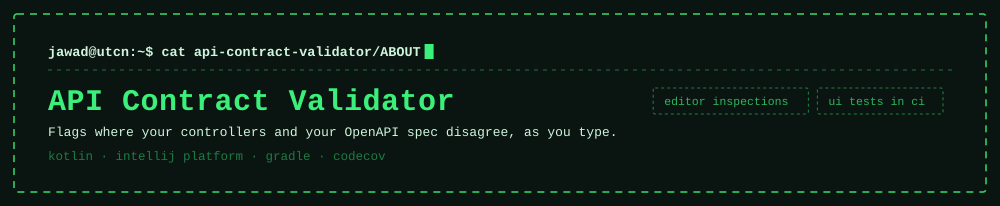
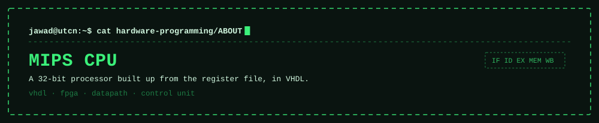
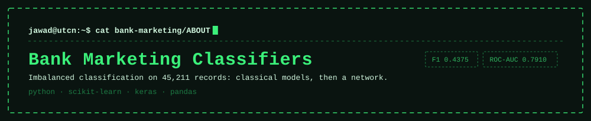
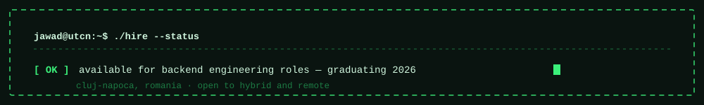

<div align="center">


<br><br>


**[email](mailto:YOUR@EMAIL.COM)** · **[linkedin](https://linkedin.com/in/YOUR-HANDLE)** · **[cv](docs/cv.pdf)** · cluj-napoca, romania

</div>

---

I write backend services in Java and Spring Boot, and I'm comfortable further down the stack than
most people who do.

That's meant literally. These repositories hold a 32-bit MIPS processor in VHDL, POSIX threading and
Linux system calls in C, a graphics library where the matrix arithmetic is written out rather than
imported, and a Spring Boot platform with 265 endpoints over a 91-table schema. Working at both ends
made me better at the middle. I have a decent instinct for where a boundary between layers belongs,
and I notice when something is asserted to work rather than shown to.

Final year at the Technical University of Cluj-Napoca, Faculty of Automation and Computer Science.
Graduating in 2026, looking for a backend or systems engineering role.

---

## Stack



---

## Projects

<a href="https://github.com/jaf-git/flowops">

</a>

Small businesses run on processes nobody ever wrote down, and when someone leaves, the process leaves
with them. Existing process-mining tools want an event log that a twelve-person studio doesn't have.
FlowOps starts from what actually exists — somebody taps a circle beside a chat message — and derives
everything else from that.

```console
jawad@utcn:~/flowops$ ./gradlew check
  ✓ 17 bounded contexts, dependency rules enforced by ArchUnit in CI
  ✓ 91 tables over 104 forward-only Flyway migrations
  ✓ invariants held by partial unique indexes, not service-layer checks
  ✓ every endpoint round-tripped against real PostgreSQL in Testcontainers
  ✓ gitleaks · semgrep · owasp dependency-check · four custom merge gates
```

The constraint I'm most pleased with is the scope test every feature has to pass: does this help a
business discover, document or run a process it already performs, without ever producing a number
about a person? A per-person productivity score clears every technical review and fails that sentence.

**[read the write-up →](https://github.com/jaf-git/flowops)**

<br>

<a href="https://github.com/jaf-git/api-contract-validator">

</a>

Your OpenAPI spec and your controllers drift apart quietly, and a consumer usually finds out before
you do. This reads the spec, walks the route handlers, and reports every disagreement as an editor
inspection you can click straight to.

Running inside the IDE changes the engineering problem. The analysis has to work incrementally, on
files that are partial and often won't compile, without blocking the event dispatch thread. It ships
like real software too: a changelog, a Marketplace listing generated at build time, Codecov coverage,
and UI tests that drive a live IDE in CI.

**[see the plugin →](https://github.com/jaf-git/api-contract-validator)**

<br>

<a href="https://github.com/jaf-git/hardware-programming">

</a>

A 32-bit MIPS processor built up from the register file: datapath, control unit, instruction and data
memory, a test program and an instruction-set map. The control unit reads the opcode and nothing else,
and produces every signal the rest of the machine needs.

There is no print statement in a datapath, so debugging happens in a waveform viewer. It also changed
how I read assembly permanently. You can see why a branch costs what it costs, and why `lw` is the
instruction that complicates the whole design. For backend work that matters more than it sounds like
it should: knowing what a memory access actually costs is the difference between reasoning about
performance and guessing at it.

**[see the design →](https://github.com/jaf-git/hardware-programming)**

<br>

<a href="https://github.com/jaf-git/bank-marketing-neural-network-classifier">

</a>

Two comparable studies on the same 45,211-record dataset, sharing a split, a seed and a preprocessing
pipeline so the comparison means something.

Only 11.7% of records are positive, so predicting "no" for everyone scores 88.3% accuracy. The study
is built around refusing that number: accuracy is reported and never used to select a model. I also
dropped `duration` from the features, since call length is only known once the call has ended and long
calls are the ones that convert. Keeping it inflates every metric and answers a question nobody can
ask before picking up the phone.

Best result: F1 0.4375, ROC-AUC 0.7910. Modest figures, and honest ones.

**[classical models →](https://github.com/jaf-git/bank-marketing-term-deposit-subscription-prediction)** · **[neural network →](https://github.com/jaf-git/bank-marketing-neural-network-classifier)**

---

## Algorithms


Separate projects, each built and run, most of them written twice. Writing a structure in a second
language is what tells you whether you understood it or just remembered the shape of the code.

<details>
<summary><code>graphs</code> — shortest paths, spanning trees, traversal</summary>

<br>

| Algorithm | Complexity | Note |
|:--|:--|:--|
| Dijkstra, set-based | `O(E log V)` | A set rather than a heap, so a key can be decreased |
| Kruskal with union-find | `O(E log E)` | Path compression makes the cycle test near-constant |
| Kruskal, naive cycle test | `O(E·V)` | Built first on purpose, to show what union-find buys |
| Prim | `O(E log V)` | The same tree, grown instead of assembled |
| BFS and DFS | `O(V+E)` | Java and C++ |
| Multi-source BFS | `O(V+E)` | Seed the queue with every source; the traversal is unchanged |
| Cycle detection, undirected | `O(V+E)` | The parent check is not the visited check |
| Bipartite check | `O(V+E)` | Two-colouring via DFS |
| Connected components | `O(V²)` | On an adjacency matrix |
| Shortest path in a binary maze | `O(R·C)` | BFS on an implicit graph |

[repository →](https://github.com/jaf-git/graphs-data-structure)

</details>

<details>
<summary><code>trees</code> — traversal, construction, path problems</summary>

<br>

| Algorithm | Complexity | Note |
|:--|:--|:--|
| Morris traversal | `O(n)` time, `O(1)` space | Threading the tree instead of carrying a stack |
| Iterative traversal | `O(n)` | Explicit stack, which is what recursion was doing for you |
| B-tree construction | — | Node splitting and order invariants |
| Lowest common ancestor | `O(n)` | Bottom-up, single pass |
| Maximum path sum | `O(n)` | The value returned upward differs from the value recorded |
| Diameter and height | `O(n)` | One post-order pass returning two things |
| Rebuild from in-order and pre-order | `O(n)` | Why that pair is sufficient |
| Rebuild from in-order and post-order | `O(n)` | The mirror argument |
| Children-sum property | `O(n)` | Mutating a tree to satisfy an invariant |
| Identical-tree check | `O(n)` | Structural equality |

[repository →](https://github.com/jaf-git/Trees-Data-Structure)

</details>

<details>
<summary><code>recursion & dp</code> — the full progression</summary>

<br>

The two repositories are a deliberate pair. Each problem appears first as plain recursion, then
memoised, then tabulated, because the route between them is the lesson.

```
recursion  ──▶  memoise  ──▶  tabulate  ──▶  shrink the table
exponential     top-down      bottom-up      O(1) space
```

| Problem | Technique |
|:--|:--|
| Fibonacci | The canonical progression, exponential to constant space |
| Frog jump | First problem where the recurrence isn't obvious from the statement |
| Subsequence generation | Take or skip, the shape underneath most subset DP |
| Target-sum subsets | The same recursion with a pruning condition |
| Sorting algorithms | C++ |

[recursion →](https://github.com/jaf-git/recursive-algorithms) · [dynamic programming →](https://github.com/jaf-git/Dynamic-Programming)

</details>

<details>
<summary><code>concurrency</code> — threads, synchronisation, coordination</summary>

<br>

| Problem | What it demonstrates |
|:--|:--|
| Dining philosophers | Deadlock comes from an ordering, not from a bug in any one thread |
| Recursive filesystem search | Fan-out where you don't know the fan-out in advance |
| The same, with wait groups | Knowing when work that spawns work has actually finished |
| Parallel page fetching | I/O-bound parallelism, where threads genuinely pay |
| Queue management simulation | Correctness that has to be measured rather than asserted |
| POSIX threads and mutexes | Against the C API directly |

[multithreading →](https://github.com/jaf-git/Multithreading-Space) · [queue simulation →](https://github.com/jaf-git/queues-management-app-using-threads) · [linux →](https://github.com/jaf-git/Linux-OS-Space)

</details>

---

## How I work

**I break a test to check it works.** A passing suite can rest on a false guarantee: an assertion that
never executes, a traversal order that happens to satisfy a rule the code doesn't enforce, a runner
that quietly collects fewer files than exist and prints a pass anyway. When a test matters, I break the
code underneath it and watch for red.

**Rules nobody enforces stop being followed.** Architecture boundaries, permission names, contrast
floors. Writing them down works until the first busy afternoon, so in FlowOps they're build failures
instead, and each gate carries a comment naming the defect that got past everything already watching.

**Invariants belong in the schema.** A service-layer check is correct until a second caller appears, a
migration runs, or someone opens a database client. A partial unique index is correct regardless.

**Comments should explain why.** Most explain what, which the code already says. The `.env.example` in
my thesis project describes what each variable is for and what breaks when it's wrong, because the one
people forget is the one whose failure looks like an unrelated problem.

---

## Coursework

B.Eng. Automation and Computer Science, Technical University of Cluj-Napoca.

| Area | Repository | Language |
|:--|:--|:--|
| Operating systems | [Linux-OS-Space](https://github.com/jaf-git/Linux-OS-Space) | C, Python |
| Computer architecture | [hardware-programming](https://github.com/jaf-git/hardware-programming) | VHDL |
| Computer graphics | [Computer-Graphics](https://github.com/jaf-git/Computer-Graphics) | C, C++ |
| Software design | [polynomial-calculator](https://github.com/jaf-git/polynomial-calculator) · [Orders-Management](https://github.com/jaf-git/Orders-Management-application) | Java |
| Full-stack | [JBank](https://github.com/jaf-git/JBank-Repository) | Java, TypeScript |
| Intelligent systems | [classical](https://github.com/jaf-git/bank-marketing-term-deposit-subscription-prediction) · [neural](https://github.com/jaf-git/bank-marketing-neural-network-classifier) | Python |

Working languages: Arabic (native), English (professional), Romanian (professional).

---

<div align="center">

<a href="https://github.com/jaf-git/flowops">

</a>

<br><br>

**[email](mailto:YOUR@EMAIL.COM)** · **[linkedin](https://linkedin.com/in/YOUR-HANDLE)** · **[flowops](https://github.com/jaf-git/flowops)**

</div>
