<div align="center">



  

<a href="https://github.com/jaf-git/flowops"></a> <a href="mailto:YOUR@EMAIL.COM"></a>

<a href="https://github.com/jaf-git/api-contract-validator"></a> <a href="https://github.com/jaf-git/hardware-programming"></a>

<a href="https://github.com/jaf-git/bank-marketing-neural-network-classifier"></a>







<br>

### [email](mailto:YOUR@EMAIL.COM) &nbsp;·&nbsp; [linkedin](https://linkedin.com/in/YOUR-HANDLE) &nbsp;·&nbsp; [cv](docs/cv.pdf)

</div>

<br>

<details>
<summary><b>Graphs</b> — 10</summary>

<br>

| Algorithm | Complexity |
|:--|:--|
| Dijkstra, set-based | `O(E log V)` |
| Kruskal with union-find | `O(E log E)` |
| Kruskal, naive cycle test | `O(E·V)` |
| Prim | `O(E log V)` |
| BFS and DFS | `O(V+E)` |
| Multi-source BFS | `O(V+E)` |
| Cycle detection, undirected | `O(V+E)` |
| Bipartite check | `O(V+E)` |
| Connected components | `O(V²)` |
| Shortest path, binary maze | `O(R·C)` |

[repository →](https://github.com/jaf-git/graphs-data-structure)

</details>

<details>
<summary><b>Trees</b> — 10</summary>

<br>

| Algorithm | Complexity |
|:--|:--|
| Morris traversal | `O(n)` time, `O(1)` space |
| Iterative traversal | `O(n)` |
| B-tree construction | — |
| Lowest common ancestor | `O(n)` |
| Maximum path sum | `O(n)` |
| Diameter and height | `O(n)` |
| Rebuild from in-order + pre-order | `O(n)` |
| Rebuild from in-order + post-order | `O(n)` |
| Children-sum property | `O(n)` |
| Identical-tree check | `O(n)` |

[repository →](https://github.com/jaf-git/Trees-Data-Structure)

</details>

<details>
<summary><b>Recursion, DP and concurrency</b> — 11</summary>

<br>

```
recursion  ──▶  memoise  ──▶  tabulate  ──▶  shrink the table
exponential     top-down      bottom-up      O(1) space
```

Fibonacci · frog jump · subsequence generation · target-sum subsets · sorting
Dining philosophers · recursive filesystem search · wait groups · parallel fetching · queue simulation · POSIX mutexes

[recursion →](https://github.com/jaf-git/recursive-algorithms) · [dp →](https://github.com/jaf-git/Dynamic-Programming) · [threads →](https://github.com/jaf-git/Multithreading-Space) · [queues →](https://github.com/jaf-git/queues-management-app-using-threads)

</details>

<details>
<summary><b>Coursework</b> — UTCN, Automation and Computer Science</summary>

<br>

| Area | Repository | Language |
|:--|:--|:--|
| Operating systems | [Linux-OS-Space](https://github.com/jaf-git/Linux-OS-Space) | C, Python |
| Computer architecture | [hardware-programming](https://github.com/jaf-git/hardware-programming) | VHDL |
| Computer graphics | [Computer-Graphics](https://github.com/jaf-git/Computer-Graphics) | C, C++ |
| Software design | [polynomial-calculator](https://github.com/jaf-git/polynomial-calculator) · [Orders-Management](https://github.com/jaf-git/Orders-Management-application) | Java |
| Full-stack | [JBank](https://github.com/jaf-git/JBank-Repository) | Java, TypeScript |
| Intelligent systems | [classical](https://github.com/jaf-git/bank-marketing-term-deposit-subscription-prediction) · [neural](https://github.com/jaf-git/bank-marketing-neural-network-classifier) | Python |

Arabic (native) · English (professional) · Romanian (professional)

</details>
