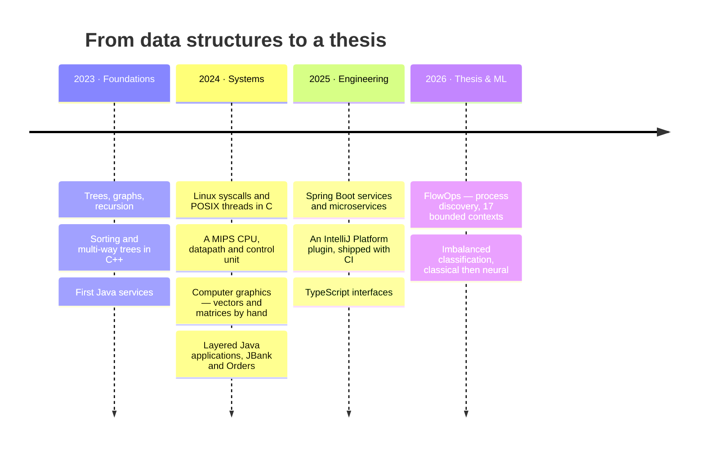

<div align="center">


<br>


</div>

---

I build backends that have to be right, and I like the parts of the stack most people skip.

That is not a slogan — it is what is actually in these repositories. There is a 32-bit MIPS processor
here, decomposed into a datapath and a control unit. There is a filesystem format parsed byte by byte
in C. There is a computer-graphics library where every matrix multiply is written out by hand because
using a library would have defeated the point. And there is a 265-endpoint Spring Boot application
with 91 tables that recovers business processes nobody ever wrote down.

I care about two things more than anything else: **where the boundaries between layers are**, and
**whether a thing can be proven to work** rather than asserted to.

**Currently** — finishing my bachelor's thesis at the Technical University of Cluj-Napoca, and
building [FlowOps](https://github.com/jaf-git/flowops).

---

## Selected work

<table>
<tr>
<td width="50%" valign="top">

### ⬢ [FlowOps](https://github.com/jaf-git/flowops)
**Bachelor's thesis · Java · Spring Boot · React · PostgreSQL**

Small businesses run on processes nobody wrote down. FlowOps watches the work already happening in
chat and hands back the process that was always there.

`17 bounded contexts` `265 endpoints` `91 tables` `506 test files`

</td>
<td width="50%" valign="top">

### ⬢ [API Contract Validator](https://github.com/jaf-git/api-contract-validator)
**IntelliJ IDEA plugin · Kotlin · Java · Gradle**

Your OpenAPI spec says one thing, your controllers do another, and nobody notices until a client
breaks. This underlines the mismatch while you type.

`editor inspections` `no CI round-trip` `Codecov` `UI tests in CI`

</td>
</tr>
<tr>
<td width="50%" valign="top">

### ⬢ [MIPS CPU Design](https://github.com/jaf-git/hardware-programming)
**Digital design · VHDL · FPGA**

A 32-bit MIPS processor built from the register file up — datapath, control unit, instruction and
data memory.

`IF · ID · EX · MEM · WB` `control from opcode alone`

</td>
<td width="50%" valign="top">

### ⬢ [Bank Marketing Classifiers](https://github.com/jaf-git/bank-marketing-neural-network-classifier)
**Machine learning · Keras · scikit-learn · Python**

Term-deposit prediction on 45,211 UCI records, as two comparable studies: classical models first,
then a tuned neural network.

`F1 0.4375` `ROC-AUC 0.7910` `class-imbalance aware`

</td>
</tr>
</table>

<details>
<summary><b>Why each of these was harder than it looks</b></summary>

<br>

**FlowOps — the observing zone must not become a second task engine.**
The product derives a process graph from chat messages. The temptation is to let a marked message
become a task immediately, and that temptation is wrong: an observation that writes into the running
product turns every measurement into a thing the measurement caused. So a node never becomes a task,
and exactly one artefact crosses the boundary — an approved template. The rule is enforced by an
architecture test, not by a comment.

The scope test every feature is measured against is the one I am most pleased with: *does this help a
business discover, document or run a process it already performs, **without ever producing a number
about a person***? A per-person productivity score would pass every technical review and fail that
sentence.

**API Contract Validator — the IDE is the deadline.**
A CI check that catches spec drift is useful. A check that catches it before you have finished typing
the method signature is a different product. Working inside the IntelliJ Platform means the analysis
has to run incrementally, on a partial and often un-compilable file, without blocking the EDT. It also
means the plugin is shipped software with a changelog, a marketplace listing generated from the README
itself, and UI tests that drive a real IDE in CI.

**MIPS CPU — you cannot print-debug a datapath.**
Every abstraction above it stops being magic once you have built one: you can see exactly why a branch
costs what it costs, and why `lw` is the instruction that complicates everything. The control unit
reads nothing but the opcode and produces every signal the rest of the machine needs. Get one
multiplexer select wrong and the processor executes a different instruction set, silently.

**Bank Marketing — the accuracy number is a trap.**
11.7 % of the records are positive, so predicting "no" for everybody scores 88.3 % accuracy. The whole
study is built around refusing that: accuracy is reported and never used to choose a model, and `F1`,
recall and ROC-AUC carry the decision. `duration` — call length — is dropped from the features
entirely, because it is only known after the call ends and long calls are mechanically the ones that
convert. Keeping it leaks the answer and inflates every metric.

</details>

---

## The foundations

Before any of the above, there was a lot of deliberate practice. These repositories are the algorithm
work, implemented rather than read about — most of it written twice, once in **Java** and once in
**C++**, because an algorithm you can only express in one language is one you have partly memorised.

<details open>
<summary><b>Trees</b> — <a href="https://github.com/jaf-git/Trees-Data-Structure">Trees-Data-Structure</a></summary>

<br>

| Problem | The idea it teaches |
|---|---|
| B-tree construction, linked-list representation | Node splitting and order invariants, without an array to hide behind |
| Iterative traversal **with a stack** | What recursion was doing for you all along |
| Iterative traversal **without extra space** | Morris traversal — threading the tree to get O(1) space |
| Height, diameter | The same post-order pass, returning two different things |
| Maximum path sum | Why the value you return upward differs from the value you record |
| Lowest common ancestor | Bottom-up beats two root-to-node walks |
| Children-sum property | Mutating a tree to satisfy an invariant, top-down then bottom-up |
| Construct from **inorder + preorder** | Why that pair is sufficient |
| Construct from **inorder + postorder** | …and why this pair needs the mirror argument |
| Check two trees identical | Structural equality, the base case everyone gets wrong first |

</details>

<details>
<summary><b>Graphs</b> — <a href="https://github.com/jaf-git/graphs-data-structure">graphs-data-structure</a></summary>

<br>

| Problem | The idea it teaches |
|---|---|
| BFS, DFS | Both in Java **and** C++ — the traversal is the primitive everything else is built from |
| Cycle detection, undirected | Why the parent check is not the same as the visited check |
| Bipartite check (DFS) | Two-colouring, and what a conflict actually proves |
| Number of provinces | Connected components on an adjacency matrix |
| Rotten oranges | Multi-source BFS — the trick is seeding the queue, not the traversal |
| Shortest distance in a binary maze | BFS on an implicit graph nobody handed you |
| Dijkstra, with sets | Why a set beats a heap when you need to *decrease* a key |
| **Kruskal** | Sort the edges, then the only hard part is the cycle test |
| **Kruskal with disjoint sets** | Union-find with path compression — the cycle test made nearly free |
| **Prim** | The same tree, grown instead of assembled |

</details>

<details>
<summary><b>Recursion and dynamic programming</b> — <a href="https://github.com/jaf-git/recursive-algorithms">recursive-algorithms</a> · <a href="https://github.com/jaf-git/Dynamic-Programming">Dynamic-Programming</a></summary>

<br>

The two repositories are deliberately a pair. The same problems appear in both, first as plain
recursion and then memoised and tabulated, because the route from one to the other is the actual
lesson:

```
recursion  ─▶  memoise it  ─▶  tabulate it  ─▶  shrink the table
 exponential     top-down        bottom-up        O(1) space
```

| Problem | Where it goes |
|---|---|
| Fibonacci | The canonical example — exponential, then linear, then constant space |
| Frog jump | The first problem where the recurrence is not obvious from the statement |
| Printing subsequences | Take / don't-take, the shape underneath most of subset DP |
| Subsequences with a target sum | The same recursion, now with a pruning condition |

</details>

<details>
<summary><b>Concurrency</b> — <a href="https://github.com/jaf-git/Multithreading-Space">Multithreading-Space</a> · <a href="https://github.com/jaf-git/queues-management-app-using-threads">queues-management-app-using-threads</a></summary>

<br>

| Problem | The idea it teaches |
|---|---|
| Dining philosophers | Deadlock is a property of an ordering, not of a bug |
| Recursive filesystem search | Fan-out where you do not know the fan-out in advance |
| …with wait groups | Knowing when work that spawns work is actually finished |
| Counting letters across fetched pages | I/O-bound parallelism — where threads genuinely pay |
| Queue management simulation | A simulation whose correctness is a statistic, not an assertion |

</details>

---

## What I can do, grouped by what it is for

| | |
|---|---|
| **Backend services** | Java 21 · Spring Boot · Spring Security · Spring Data JPA · REST design · OpenAPI · Flyway migrations · session and permission models |
| **Data** | PostgreSQL — schema design, foreign-key modelling, partial and unique indexes as constraints rather than as speed, forward-only migration discipline |
| **Frontend** | TypeScript · React · TanStack Query · React Flow · Tailwind · design tokens and accessibility contrast floors |
| **Systems & low level** | C · POSIX threads and synchronisation · Linux system calls · binary file formats · VHDL and digital design |
| **Machine learning** | Python · Keras / TensorFlow · scikit-learn · pandas — imbalanced classification, leakage avoidance, honest metric selection |
| **Algorithms** | Trees, graphs, shortest paths, spanning trees, union-find, dynamic programming — implemented, in two languages |
| **Engineering practice** | Testcontainers · ArchUnit · JUnit · Vitest · Playwright · GitHub Actions · gitleaks · Semgrep · OWASP dependency checks · mutation-style review |
| **Tooling** | Gradle · Maven · Docker Compose · IntelliJ Platform plugin development |

---

## How this got built, year by year



<details>
<summary><b>The coursework behind it</b></summary>

<br>

| Area | Repository | Language |
|---|---|---|
| Data structures & algorithms | [Trees](https://github.com/jaf-git/Trees-Data-Structure) · [Graphs](https://github.com/jaf-git/graphs-data-structure) · [Recursion](https://github.com/jaf-git/recursive-algorithms) · [DP](https://github.com/jaf-git/Dynamic-Programming) | Java, C++ |
| Operating systems | [Linux-OS-Space](https://github.com/jaf-git/Linux-OS-Space) | C, Python |
| Computer graphics | [Computer-Graphics](https://github.com/jaf-git/Computer-Graphics) | C, C++ |
| Digital design | [hardware-programming](https://github.com/jaf-git/hardware-programming) | VHDL |
| Concurrency | [Multithreading-Space](https://github.com/jaf-git/Multithreading-Space) · [queues-management](https://github.com/jaf-git/queues-management-app-using-threads) | Java |
| Programming techniques | [polynomial-calculator](https://github.com/jaf-git/polynomial-calculator) · [Orders-Management](https://github.com/jaf-git/Orders-Management-application) | Java |
| Full-stack | [JBank](https://github.com/jaf-git/JBank-Repository) | Java, TypeScript |
| Intelligent systems | [classical models](https://github.com/jaf-git/bank-marketing-term-deposit-subscription-prediction) · [neural network](https://github.com/jaf-git/bank-marketing-neural-network-classifier) | Python |

</details>

---

## How I work

<details open>
<summary><b>Four opinions I hold, and where each one came from</b></summary>

<br>

**A green test run is a claim, not a fact.**
A passing suite can sit on a false guarantee — a traversal order that happens to hold the rule the
code does not, an assertion that never executes, a runner that silently collects fewer files than
exist and prints a pass anyway. When I want to know a test works, I break the code and watch it go
red. If it does not redden, the test was decoration.

**A rule nobody enforces is a rule that decays.**
Architecture boundaries, permission names, contrast floors — writing them down protects them until
the first busy afternoon. So they become build failures instead. Every gate I have added exists
because something got past everything already watching, and the comment above each one names the
defect that caused it.

**Derived state should be derived.**
A stored flag is correct at the moment it is written and stale the moment the underlying facts move.
It never announces this. It just quietly stops being true. Compute it on read unless there is a
measured reason not to.

**Write it so the next person does not have to ask.**
Most of what a comment should say is *why*, and most code comments say *what*. The `.env.example` in
my thesis project explains what each variable is for and what breaks if it is wrong, because the
variable people forget is the one whose failure looks like something else entirely.

</details>

---

<div align="center">

### Start here → **[FlowOps](https://github.com/jaf-git/flowops)**

The thesis project, and the clearest picture of how I build.

<br>

<sub>Technical University of Cluj-Napoca · Faculty of Automation and Computer Science · Cluj-Napoca, Romania</sub>

</div>
