 

**[Email](mailto:YOUR@EMAIL.COM)** · **[LinkedIn](https://linkedin.com/in/YOUR-HANDLE)** · **[CV](docs/cv.pdf)** · Cluj-Napoca, Romania

---

I write backend services, and I'm comfortable further down the stack than most people who do.

That's meant literally. These repositories contain a 32-bit MIPS processor in VHDL, POSIX threading
and Linux system calls in C, a graphics library where the matrix arithmetic is written out rather
than imported, and a Spring Boot platform with 265 endpoints across 91 tables. Working at both ends
has made me better at the middle: I have a reasonable instinct for where a boundary between layers
belongs, and I tend to notice when something is asserted to work rather than shown to.

Final year at the Technical University of Cluj-Napoca, Faculty of Automation and Computer Science.
Graduating in 2026 and looking for a backend or systems engineering role.

---

## Selected work

### [FlowOps](https://github.com/jaf-git/flowops) — bachelor's thesis
`Java 21` `Spring Boot 3.5` `React 19` `PostgreSQL 16`

Small businesses run on processes nobody ever wrote down. Process-mining tools assume an event log
that a twelve-person studio doesn't have. FlowOps derives the process from chat messages people were
already sending, and hands it back as something they can run.

Hexagonal architecture across 17 bounded contexts, 265 endpoints, 104 forward-only migrations, and
506 test files. Every HTTP endpoint has a full-stack round-trip test against a real PostgreSQL
instance in Testcontainers.

The design constraint I'm most pleased with is a scope test every feature has to pass: does this help
a business discover, document or run a process it already performs, without ever producing a number
about a person? A per-person productivity score would clear every technical review and fail that
sentence.

### [API Contract Validator](https://github.com/jaf-git/api-contract-validator)
`Kotlin` `IntelliJ Platform` `Gradle`

Checks backend implementation against an OpenAPI specification as ordinary editor inspections. The
mismatch is underlined while you type rather than reported by CI twenty minutes later.

Running inside the IDE means the analysis has to work incrementally, on files that are partial and
frequently won't compile, without blocking the event dispatch thread. Shipped with a changelog,
Codecov reporting, and UI tests that drive a real IDE in CI.

### [MIPS CPU](https://github.com/jaf-git/hardware-programming)
`VHDL` `FPGA`

A 32-bit MIPS processor built up from the register file: datapath, control unit, instruction and data
memory. The control unit reads the opcode and nothing else, and produces every signal the rest of the
machine needs.

There's no print statement in a datapath. Debugging happens in a waveform viewer, which is a useful
thing to have been forced to learn. It also permanently changed how I read assembly: you can see why
a branch costs what it costs, and why `lw` is the instruction that complicates the whole design.

### Bank Marketing classifiers
`Python` `scikit-learn` `Keras`

Term-deposit prediction on 45,211 UCI records, run as two comparable studies —
[classical models](https://github.com/jaf-git/bank-marketing-term-deposit-subscription-prediction)
and a [neural network](https://github.com/jaf-git/bank-marketing-neural-network-classifier) — sharing
a split, a seed and a preprocessing pipeline.

Only 11.7% of records are positive, so predicting "no" for everyone scores 88.3% accuracy. The study
is built around refusing that number: accuracy is reported but never used to select a model. I also
dropped `duration` from the features, since call length is only known after the call ends and long
calls are the ones that convert. Keeping it inflates every metric and answers a question nobody can
ask in practice.

Best result: F1 0.4375, ROC-AUC 0.7910. Modest figures, and honest ones.

---

## Skills

| | |
|---|---|
| **Backend** | Java 21, Spring Boot, Spring Security, Spring Data JPA, REST and OpenAPI, Flyway, session and permission design |
| **Data** | PostgreSQL — schema design, foreign-key modelling, unique and partial indexes as constraints, forward-only migrations |
| **Frontend** | TypeScript, React, TanStack Query, React Flow, Tailwind, design tokens, accessibility contrast requirements |
| **Systems** | C, POSIX threads, Linux system calls, VHDL and digital design |
| **Machine learning** | Python, scikit-learn, Keras, pandas — imbalanced classification, leakage avoidance, metric selection |
| **Testing** | JUnit 5, Testcontainers, ArchUnit, Vitest, Playwright |
| **Practice** | Git, GitHub Actions, Docker Compose, Maven, Gradle, gitleaks, Semgrep, OWASP dependency-check |

Working languages: Arabic (native), English (professional), Romanian (professional).

---

## Foundations

The algorithm work sits in four repositories, most of it written twice — once in Java and once in
C++. Writing a structure in a second language is what tells you whether you understood it or just
remembered the shape of the code.

| Area | Repository | Covers |
|---|---|---|
| Trees | [Trees-Data-Structure](https://github.com/jaf-git/Trees-Data-Structure) | B-trees, iterative and Morris traversal, LCA, maximum path sum, reconstruction from traversal pairs |
| Graphs | [graphs-data-structure](https://github.com/jaf-git/graphs-data-structure) | BFS and DFS, cycle detection, bipartite checking, Dijkstra, Kruskal with union-find, Prim |
| Recursion and DP | [recursive-algorithms](https://github.com/jaf-git/recursive-algorithms) · [Dynamic-Programming](https://github.com/jaf-git/Dynamic-Programming) | The same problems in both, so the route from exponential recursion to a tabulated solution is visible |
| Concurrency | [Multithreading-Space](https://github.com/jaf-git/Multithreading-Space) · [queues-management](https://github.com/jaf-git/queues-management-app-using-threads) | Dining philosophers, wait groups, I/O-bound parallelism, a queue simulation with one thread per queue |

Other coursework

 

| Area | Repository | Language |
|---|---|---|
| Operating systems | [Linux-OS-Space](https://github.com/jaf-git/Linux-OS-Space) | C, Python |
| Computer graphics | [Computer-Graphics](https://github.com/jaf-git/Computer-Graphics) | C, C++ |
| Programming techniques | [polynomial-calculator](https://github.com/jaf-git/polynomial-calculator) · [Orders-Management](https://github.com/jaf-git/Orders-Management-application) | Java |
| Full-stack | [JBank](https://github.com/jaf-git/JBank-Repository) | Java, TypeScript |

---

## How I work

**I break a test to check it works.** A passing suite can rest on a false guarantee: an assertion
that never executes, a traversal order that happens to satisfy a rule the code doesn't enforce, a
runner that quietly collects fewer files than exist and prints a pass. When a test matters, I break
the code underneath it and watch for red.

**Rules that nobody enforces stop being followed.** Architecture boundaries, permission names,
contrast floors — writing them down works until the first busy afternoon. In FlowOps they're build
failures instead, and each gate carries a comment naming the defect that got past everything already
watching.

**Comments should explain why.** Most of them explain what, which the code already says. The
`.env.example` in my thesis project describes what each variable is for and what breaks when it's
wrong, because the one people forget is the one whose failure looks like an unrelated problem.

---

**Start with [FlowOps](https://github.com/jaf-git/flowops)** — it's the clearest picture of how I build.

 

Technical University of Cluj-Napoca · Faculty of Automation and Computer Science

