<div align="center"><a href="https://github.com/jaf-git/flowops"></a><a href="https://github.com/jaf-git/api-contract-validator"></a><a href="https://github.com/jaf-git/hardware-programming"></a><a href="https://github.com/jaf-git/bank-marketing-neural-network-classifier"></a><a href="https://github.com/jaf-git/flowops"></a>

<br>

**[email](mailto:YOUR@EMAIL.COM)** · **[linkedin](https://linkedin.com/in/YOUR-HANDLE)** · **[cv](docs/cv.pdf)** · cluj-napoca, romania


</div>

<details>
<summary><code>graphs</code> — shortest paths, spanning trees, traversal</summary>

<br>

| Algorithm | Complexity | Note |
|:--|:--|:--|
| Dijkstra, set-based | `O(E log V)` | A set rather than a heap, so a key can be decreased |
| Kruskal with union-find | `O(E log E)` | Path compression makes the cycle test near-constant |
| Kruskal, naive cycle test | `O(E·V)` | Built first on purpose, to show what union-find buys |
| Prim | `O(E log V)` | The same tree, grown instead of assembled |
| BFS and DFS | `O(V+E)` | Java and C++ |
| Multi-source BFS | `O(V+E)` | Seed the queue with every source; the traversal is unchanged |
| Cycle detection, undirected | `O(V+E)` | The parent check is not the visited check |
| Bipartite check | `O(V+E)` | Two-colouring via DFS |
| Connected components | `O(V²)` | On an adjacency matrix |
| Shortest path in a binary maze | `O(R·C)` | BFS on an implicit graph |

[repository →](https://github.com/jaf-git/graphs-data-structure)

</details>

<details>
<summary><code>trees</code> — traversal, construction, path problems</summary>

<br>

| Algorithm | Complexity | Note |
|:--|:--|:--|
| Morris traversal | `O(n)` time, `O(1)` space | Threading the tree instead of carrying a stack |
| Iterative traversal | `O(n)` | Explicit stack, which is what recursion was doing for you |
| B-tree construction | — | Node splitting and order invariants |
| Lowest common ancestor | `O(n)` | Bottom-up, single pass |
| Maximum path sum | `O(n)` | The value returned upward differs from the value recorded |
| Diameter and height | `O(n)` | One post-order pass returning two things |
| Rebuild from in-order and pre-order | `O(n)` | Why that pair is sufficient |
| Rebuild from in-order and post-order | `O(n)` | The mirror argument |
| Children-sum property | `O(n)` | Mutating a tree to satisfy an invariant |
| Identical-tree check | `O(n)` | Structural equality |

[repository →](https://github.com/jaf-git/Trees-Data-Structure)

</details>

<details>
<summary><code>recursion &amp; dp</code> — the full progression</summary>

<br>

Each problem appears first as plain recursion, then memoised, then tabulated, because the route
between them is the lesson.

```
recursion  ──▶  memoise  ──▶  tabulate  ──▶  shrink the table
exponential     top-down      bottom-up      O(1) space
```

| Problem | Technique |
|:--|:--|
| Fibonacci | The canonical progression, exponential to constant space |
| Frog jump | First problem where the recurrence isn't obvious from the statement |
| Subsequence generation | Take or skip, the shape underneath most subset DP |
| Target-sum subsets | The same recursion with a pruning condition |
| Sorting algorithms | C++ |

[recursion →](https://github.com/jaf-git/recursive-algorithms) · [dynamic programming →](https://github.com/jaf-git/Dynamic-Programming)

</details>

<details>
<summary><code>concurrency</code> — threads, synchronisation, coordination</summary>

<br>

| Problem | What it demonstrates |
|:--|:--|
| Dining philosophers | Deadlock comes from an ordering, not from a bug in any one thread |
| Recursive filesystem search | Fan-out where you don't know the fan-out in advance |
| The same, with wait groups | Knowing when work that spawns work has actually finished |
| Parallel page fetching | I/O-bound parallelism, where threads genuinely pay |
| Queue management simulation | Correctness that has to be measured rather than asserted |
| POSIX threads and mutexes | Against the C API directly |

[multithreading →](https://github.com/jaf-git/Multithreading-Space) · [queue simulation →](https://github.com/jaf-git/queues-management-app-using-threads) · [linux →](https://github.com/jaf-git/Linux-OS-Space)

</details>

<details>
<summary><code>coursework</code> — B.Eng. Automation and Computer Science, UTCN</summary>

<br>

| Area | Repository | Language |
|:--|:--|:--|
| Operating systems | [Linux-OS-Space](https://github.com/jaf-git/Linux-OS-Space) | C, Python |
| Computer architecture | [hardware-programming](https://github.com/jaf-git/hardware-programming) | VHDL |
| Computer graphics | [Computer-Graphics](https://github.com/jaf-git/Computer-Graphics) | C, C++ |
| Software design | [polynomial-calculator](https://github.com/jaf-git/polynomial-calculator) · [Orders-Management](https://github.com/jaf-git/Orders-Management-application) | Java |
| Full-stack | [JBank](https://github.com/jaf-git/JBank-Repository) | Java, TypeScript |
| Intelligent systems | [classical](https://github.com/jaf-git/bank-marketing-term-deposit-subscription-prediction) · [neural](https://github.com/jaf-git/bank-marketing-neural-network-classifier) | Python |

Working languages: Arabic (native), English (professional), Romanian (professional).

</details>
