<div align="center">



<br><br>

[](#technical-stack)
[](#technical-stack)
[](#technical-stack)
[](#technical-stack)
[](#technical-stack)

</div>

<br>

---

<br>

<div align="center">

### I build backend systems in Java and Spring Boot — and I can prove they work.

<br>

Final-year Computer Science engineering student at the Technical University of Cluj-Napoca.<br>
My thesis is a **265-endpoint Spring Boot platform** with a **91-table PostgreSQL schema**, built on<br>
hexagonal architecture and covered by **506 automated test files**.

<br>

</div>

<br>

---

<br>

## At a glance

<br>

|  |  |
|:--|:--|
| **Role** | Backend Engineer — Java · Spring Boot · PostgreSQL |
| **Also strong in** | Systems programming (C, POSIX threads), algorithms, SQL modelling |
| **Education** | B.Eng. Automation & Computer Science — Technical University of Cluj-Napoca, graduating 2026 |
| **Location** | Cluj-Napoca, Romania — open to hybrid and remote |
| **Status** | Available for backend engineering roles |

<br>

---

<br>

## Technical stack

<br>



<br>

> I am strongest in the **backend and data rows**. The frontend row is real and shipped, but it is
> where I go when a service needs a face — not where I want to spend my career.

<br>

---

<br>

## Featured projects

<br>

<a href="https://github.com/jaf-git/flowops">
  
</a>

<br>

**The problem.** Small businesses run on processes nobody ever wrote down. When someone leaves, the
process leaves with them.

**What I built.** A platform that derives those processes from work already happening in chat — then
turns the recurring shapes into templates a person can approve and run.

**Engineering highlights**

- Hexagonal architecture across **17 bounded contexts**, with dependency rules enforced by **ArchUnit** in CI — not by convention
- **91-table** schema over **104 forward-only Flyway migrations**; concurrency-safe invariants enforced by partial unique indexes rather than service-layer checks
- Integration tests run against a **real PostgreSQL in Testcontainers**; every HTTP endpoint has a full-stack round-trip test
- CI pipeline with **gitleaks**, **Semgrep**, **OWASP dependency-check** and four custom merge gates

**[→ Read the full technical write-up](https://github.com/jaf-git/flowops)**

<br>
<br>

<a href="https://github.com/jaf-git/api-contract-validator">
  
</a>

<br>

**The problem.** Your OpenAPI spec and your controllers drift apart silently. A consumer finds out
before you do.

**What I built.** An IntelliJ IDEA plugin that reads the spec, walks the route handlers, and reports
every disagreement — missing endpoints, wrong methods, schema drift, undeclared status codes — as
editor inspections you click straight to.

**Engineering highlights**

- Runs incrementally inside the IDE on partial, often un-compilable files, without blocking the UI thread
- Shipped as real software: changelog, Marketplace listing generated at build time, **Codecov** coverage
- **GitHub Actions** pipeline that drives a real IDE instance for UI tests

**[→ See the plugin](https://github.com/jaf-git/api-contract-validator)**

<br>
<br>

<a href="https://github.com/jaf-git/hardware-programming">
  
</a>

<br>

**Why it matters for a backend role.** Knowing what a cache miss, a branch, or a memory access
actually costs is not trivia — it is the difference between guessing at performance and reasoning
about it.

**What I built.** A 32-bit MIPS processor: datapath, control unit, instruction and data memory, plus
a test program and instruction-set map.

**[→ See the design](https://github.com/jaf-git/hardware-programming)**

<br>
<br>

<a href="https://github.com/jaf-git/bank-marketing-neural-network-classifier">
  
</a>

**What I built.** Two comparable studies on the same 45,211-record dataset — classical models first,
then a tuned neural network — held to the same split and preprocessing so the comparison means
something.

**The judgement call that mattered.** Only 11.7 % of records are positive, so predicting "no" for
everyone scores 88.3 % accuracy. Accuracy is reported and never used to select a model. I also dropped
the `duration` feature entirely: it is only known after a call ends, so keeping it leaks the answer.

**[→ Classical models](https://github.com/jaf-git/bank-marketing-term-deposit-subscription-prediction)** · **[→ Neural network](https://github.com/jaf-git/bank-marketing-neural-network-classifier)**

<br>

---

<br>

## Algorithms & data structures

<br>



<br>

Forty-plus problems implemented from scratch — **most of them twice, once in Java and once in C++**.
Not solutions copied into a file: separate projects, each built and run.

<br>

<details>
<summary><b>Graphs</b> — shortest paths, spanning trees, traversal &nbsp;·&nbsp; <a href="https://github.com/jaf-git/graphs-data-structure">view repository</a></summary>

<br>

| Algorithm | Complexity | Note |
|:--|:--|:--|
| Dijkstra (set-based) | `O(E log V)` | A set rather than a heap, so a key can be decreased |
| Kruskal + union-find | `O(E log E)` | Path compression makes the cycle test near-constant |
| Kruskal (naive cycle test) | `O(E·V)` | Built first, deliberately, to show what union-find buys |
| Prim | `O(E log V)` | The same tree, grown instead of assembled |
| BFS / DFS | `O(V+E)` | Java and C++ |
| Multi-source BFS | `O(V+E)` | Seed the queue with every source — the traversal is unchanged |
| Cycle detection (undirected) | `O(V+E)` | The parent check is not the visited check |
| Bipartite check | `O(V+E)` | Two-colouring via DFS |
| Connected components | `O(V²)` | On an adjacency matrix |
| Shortest path in a binary maze | `O(R·C)` | BFS on an implicit graph |

</details>

<details>
<summary><b>Trees</b> — traversal, construction, path problems &nbsp;·&nbsp; <a href="https://github.com/jaf-git/Trees-Data-Structure">view repository</a></summary>

<br>

| Algorithm | Complexity | Note |
|:--|:--|:--|
| Morris traversal | `O(n)` time, `O(1)` space | Threading the tree instead of using a stack |
| Iterative traversal | `O(n)` | Explicit stack — what recursion was doing for you |
| B-tree construction | — | Node splitting and order invariants, linked-list representation |
| Lowest common ancestor | `O(n)` | Bottom-up, single pass |
| Maximum path sum | `O(n)` | The value returned upward differs from the value recorded |
| Diameter and height | `O(n)` | The same post-order pass returning two different things |
| Rebuild from in-order + pre-order | `O(n)` | Why that pair is sufficient |
| Rebuild from in-order + post-order | `O(n)` | The mirror argument |
| Children-sum property | `O(n)` | Mutating a tree to satisfy an invariant |
| Identical-tree check | `O(n)` | Structural equality |

</details>

<details>
<summary><b>Recursion & dynamic programming</b> — the full progression &nbsp;·&nbsp; <a href="https://github.com/jaf-git/Dynamic-Programming">view repository</a></summary>

<br>

The two repositories are deliberately a pair: each problem appears first as plain recursion, then
memoised, then tabulated. The route between them is the lesson.

```
recursion  ──▶  memoise  ──▶  tabulate  ──▶  shrink the table
exponential     top-down      bottom-up       O(1) space
```

| Problem | Technique |
|:--|:--|
| Fibonacci | The canonical progression — exponential to constant space |
| Frog jump | First problem where the recurrence is not obvious from the statement |
| Subsequence generation | Take / skip — the shape underneath most subset DP |
| Target-sum subsets | The same recursion with a pruning condition |
| Sorting algorithms | Implemented in C++ |

</details>

<details>
<summary><b>Concurrency</b> — threads, synchronisation, coordination &nbsp;·&nbsp; <a href="https://github.com/jaf-git/Multithreading-Space">view repository</a></summary>

<br>

| Problem | What it demonstrates |
|:--|:--|
| Dining philosophers | Deadlock is a property of an ordering, not of a bug |
| Recursive filesystem search | Fan-out where the fan-out is not known in advance |
| …with wait groups | Knowing when work that spawns work has actually finished |
| Parallel page fetching | I/O-bound parallelism — where threads genuinely pay |
| Queue management simulation | Correctness expressed as a statistic, not an assertion |
| POSIX pthreads and mutexes | Against the C API directly, in [Linux-OS-Space](https://github.com/jaf-git/Linux-OS-Space) |

</details>

<br>

---

<br>

## How I work

<br>

|  |  |
|:--|:--|
| **Testing** | Unit, slice, and integration against a real database. Every endpoint has a round-trip test. |
| **Verification** | I break the code to check the test reddens. A test that never fails is decoration. |
| **Architecture** | Boundaries enforced by build failures — ArchUnit on the backend, lint rules on the frontend. |
| **Data** | Forward-only migrations. Invariants in the schema, not in the service layer. |
| **Security** | Secret scanning, SAST and dependency auditing in CI, with every accepted advisory documented. |
| **Documentation** | Comments explain *why*. The *what* is already in the code. |

<br>

---

<br>

## Education & coursework

<br>

**B.Eng. Automation & Computer Science** — Technical University of Cluj-Napoca

<br>

| Area | Repository | Language |
|:--|:--|:--|
| Data structures & algorithms | [Trees](https://github.com/jaf-git/Trees-Data-Structure) · [Graphs](https://github.com/jaf-git/graphs-data-structure) · [Recursion](https://github.com/jaf-git/recursive-algorithms) · [DP](https://github.com/jaf-git/Dynamic-Programming) | Java, C++ |
| Operating systems | [Linux-OS-Space](https://github.com/jaf-git/Linux-OS-Space) | C, Python |
| Computer architecture | [hardware-programming](https://github.com/jaf-git/hardware-programming) | VHDL |
| Computer graphics | [Computer-Graphics](https://github.com/jaf-git/Computer-Graphics) | C, C++ |
| Concurrent programming | [Multithreading-Space](https://github.com/jaf-git/Multithreading-Space) · [queues-management](https://github.com/jaf-git/queues-management-app-using-threads) | Java |
| Software design | [polynomial-calculator](https://github.com/jaf-git/polynomial-calculator) · [Orders-Management](https://github.com/jaf-git/Orders-Management-application) | Java |
| Full-stack development | [JBank](https://github.com/jaf-git/JBank-Repository) | Java, TypeScript |
| Intelligent systems | [classical](https://github.com/jaf-git/bank-marketing-term-deposit-subscription-prediction) · [neural](https://github.com/jaf-git/bank-marketing-neural-network-classifier) | Python |

<br>

---

<br>

<div align="center">

<a href="https://github.com/jaf-git/flowops">
  
</a>

<br><br>

**[View my flagship project →](https://github.com/jaf-git/flowops)**

<br>

<!-- ────────────────────────────────────────────────────────────────────────────
     CONTACT — fill these three in and delete the comment markers around them.
     A recruiter-facing profile should not rely on GitHub messaging alone.

     **[Email](mailto:you@example.com)**  ·  **[LinkedIn](https://linkedin.com/in/your-handle)**  ·  **[CV](docs/cv.pdf)**
──────────────────────────────────────────────────────────────────────────── -->

<sub>Cluj-Napoca, Romania &nbsp;·&nbsp; Reach me through <a href="https://github.com/jaf-git">GitHub</a></sub>

<br><br>

</div>
